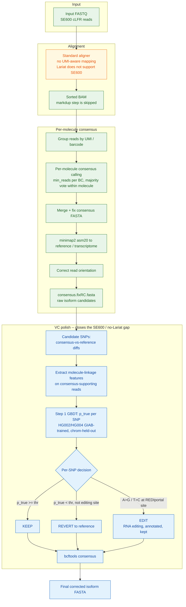

# cLFR_VCpolish: molecule-linkage confidence scoring for VC-polished consensus isoforms

## Abstract

We present `cLFR_VCpolish`, a molecule-linkage confidence model that separates a
true SNV from sequencing error or mapping error in cLFR/cWGS consensus-called
isoforms, and uses that model as a post-consensus variant-calling (VC) polish
step. Building an isoform from a per-UMI **consensus** is a faster,
lower-compute alternative to per-UMI **de novo** assembly (see
[`denovo_OLC`](https://github.com/Complete-Genomics/LFR_Pipeline/tree/main/modules/clfr/denovo))
that also directly preserves SNVs, since each molecule's consensus is called
from its own reads rather than smoothed into a shared assembly graph. For
paired-end (PE) libraries, consensus can be built on a UMI-aware **Lariat**
alignment, so molecule-consistent evidence is already baked into the BAM
before consensus calling even starts; Lariat does not support the SE data, however, so SE600 consensus calling runs on a standard,
non-UMI-aware alignment and its output isoforms carry more uncorrected
sequencing/mapping error at SNP positions. `cLFR_VCpolish`'s model closes that gap
after the fact: it scores each candidate SNP using independent-molecule
count, within-molecule agreement, and per-read mapping/quality features,
trained and chromosome-held-out validated against HG002/HG004 GIAB truth.
Genome-wide leave-one-chromosome-out cross-validation (22 folds x 2 samples)
shows adding molecule features on top of per-read features raises mean PR-AUC
by +0.0258 (HG002) / +0.0236 (HG004), with the gain following an inverted-U
across VAF -- peaking at 3-4x the aggregate delta in the 0.05-0.5 band, where
VAF alone cannot separate a true low-support het from a PCR/sequencing
artifact. Deployed as a post-consensus VC polish step (`KEEP` / `REVERT` /
`EDIT` per SNP, with RNA-editing sites protected from reversion), the model
turns a raw consensus FASTA into a corrected isoform FASTA without requiring
Lariat-grade UMI-aware mapping at alignment time.

## Introduction

Linked-read barcodes provide a natural molecule-level evidence pool: the
reads sharing one UMI came from one physical molecule. There are two ways to
turn that pool into a deliverable sequence. `denovo_OLC` assembles each
barcode's reads with an evidence-aware OLC graph, which is thorough but pays
an assembler's per-UMI process overhead at 1.5-3 million UMI scale. The
alternative used here is to skip assembly and call a **per-molecule
consensus** directly from the pileup within each UMI's own reads. This is
cheaper -- no graph construction, no overlap search, no per-UMI process
launch -- and it is not merely a faster shortcut: because the majority vote
at each position is taken across one molecule's own reads rather than merged
across a shared graph spanning multiple molecules, consensus calling
preserves genuine SNVs that a cross-molecule assembly step could smooth away.
Consensus is therefore treated here as an alternative to `denovo_OLC`, not a
degraded substitute for it.

Consensus quality depends on what the alignment already knows about molecule
structure. For paired-end (PE) libraries, reads can be mapped with the
UMI-aware **Lariat** mapper, which uses barcode/molecule linkage *during*
alignment to place reads consistently with their molecule of origin -- so by
the time consensus calling runs, molecule-consistent evidence is already
built into the BAM. Lariat does not support the SE data, so SE600
libraries are aligned with a standard, non-UMI-aware mapper instead. The
resulting SE600 consensus isoforms therefore carry more residual
sequencing/mapping error at SNP positions than the PE/Lariat path, because
the alignment step never had the chance to use molecule linkage to resolve
ambiguous placements.

`cLFR_VCpolish` exists to close that gap **after** alignment and consensus,
instead of requiring it to be solved **during** alignment. A standard
per-read pileup caller sees read counts, not whether alt support is
consistent *within independent molecules*. A true variant appears across many
independent molecules and consistently within each; a sequencing error is
scattered across single reads; a mapping error rides on low-MAPQ /
soft-clipped / repeat-adjacent reads. By re-extracting molecule-resolved
features (independent molecule count, within-molecule agreement, MAPQ/BQ/
strand/soft-clip/read-position) directly from the consensus-supporting reads
-- using the same UMI/barcode grouping Lariat would otherwise have exploited
at mapping time -- this VC polish step recovers most of the molecule-linkage
signal for SE600 without needing an SE600-capable Lariat.

## Materials and methods

### Consensus module: from FASTQ to isoform FASTA

Figure 1 shows the full SE600 path from raw FASTQ to a corrected isoform
FASTA -- this repository is scoped to SE600 only. The alignment step
(orange) is exactly the point where UMI-aware Lariat mapping is unavailable
-- Lariat does not support the SE600 chemistry -- which is why the consensus
output needs the polish stage (blue) that this repository trains and
applies; green nodes are the rest of the production consensus pipeline.



### Data and truth (Step 1 vs Step 2)

- **Step 1 (this code):** HG002 gives two gold labels from one pure sample --
  hom-ref confident positions with alt reads = **error** (negatives); GIAB
  SNV sites = **true** (positives, at germline ~50/100% AF). This is enough
  for error suppression and calibrated confidence, and needs **no titration**.
- **Step 2 (later):** true variants at *low* AF need a GIAB **titration**
  (HG002 + HG003/HG004 at known ratios). Pure HG002 has no low-AF positives,
  so low-AF sensitivity must not be claimed from Step 1 data alone.

### Feature extraction and model

`02_extract_features.py` computes molecule-grouped features per candidate
site: independent molecule count, within-molecule agreement, MAPQ, base
quality, strand, soft-clip, and read-position bias -- signal a standard
per-read pileup caller does not have access to.

`03_train_eval.py` trains a LightGBM true-vs-error classifier with a
**chromosome-held-out** test split, isotonic calibration fit only on a TRAIN
slice, and reports PR/ROC/Brier plus VAF-stratified PR-AUC and feature
importance.

The ablation trains three feature sets: `baseline` (plain pileup:
dp/alt_reads/ref_reads/vaf) -> `no_molecule` (+ per-read mapping/quality,
still no UMI) -> `all` (+ UMI/molecule features). **UMI contribution =
PR-AUC(all) - PR-AUC(no_molecule)**, reported per VAF bin rather than as one
aggregate number, because the aggregate dilutes the mid-VAF peak by 3-4x (see
Results).

```bash
# edit paths in run.sh, then:
bash run.sh
```

1. `01_make_candidates.py` -- pileup within confident BED -> labeled sites
   (true = GIAB SNV; error = confident hom-ref with alt reads).
2. `02_extract_features.py` -- molecule-grouped features per site.
3. `03_train_eval.py` -- LightGBM true-vs-error, chrom-held-out test,
   isotonic calibration, PR/ROC/Brier + VAF-stratified PR-AUC + feature
   importance.

### Step 4 -- from re-score to a VC-polished isoform

`04_apply_rescore.py` turns the scorer into the polish stage shown in Figure
1: run `02` on the reads that support each consensus call (candidates =
consensus-vs-reference diffs), then per SNP decide `KEEP` (`p_true >= thr` ->
real SNP), `REVERT` (`p_true < thr` -> error, drop), or `EDIT` (A>G/T>C at a
REDIportal site -> RNA editing, kept and annotated, never reverted). The
`KEEP` set feeds `bcftools consensus` to produce the corrected isoform FASTA.
Validation uses ERCC: per-base false-SNP rate before vs. after correction,
since a correct ERCC consensus should match the known ERCC sequence
base-for-base and any residual SNP is a consensus error. Note: the Step 1
model is DNA-trained; recalibrate on ERCC before relying on it for the
RNA/isoform application. See `readme_cn.md` for the fully worked example
command.

### Implementation

Dependencies: `pysam, pandas, numpy, scikit-learn, lightgbm` (see
`environment.yml`); `samtools, htslib, bcftools` (indexing + Step 4
consensus).

**Prerequisites -- indexes (do this first):**

| Input | Needs | Make it |
|---|---|---|
| BAM | `.bai` | `samtools index reads.bam` |
| reference FASTA | `.fai` | `samtools faidx ref.fa` |
| truth VCF | bgzip **+** tabix `.tbi` | `bgzip -c t.vcf > t.vcf.gz && tabix -p vcf t.vcf.gz` |
| confident BED | -- (read into memory) | none |

A plain `.vcf` or plain-gzip `.vcf.gz` triggers `fetch requires an index`. If
a `.vcf.gz` errors as "not a BGZF file":
`zcat t.vcf.gz | bgzip > t.bgz.vcf.gz && tabix -p vcf t.bgz.vcf.gz`.

**Running resources (per step):** the heavy steps are **01/02** (genome
pileup); **03/04** are light.

| Step | CPU | Memory | Notes |
|---|---|---|---|
| 01 make_candidates | benefits from more cores; I/O-bound on the BAM | modest (streams) | scan fewer `--regions` to cut time |
| 02 extract_features | CPU-heavy (re-pileup per candidate) | modest (streams) | scales with #candidates |
| 03 train_eval | GBDT grabs ALL cores by default -> **cap with `--threads N`** (default 8; also caps OMP/BLAS). `--n-bag N` ~ N x time | **loads features.tsv into pandas**: ~2-5 GB per ~10M rows. Confirmed empirically on a 20M-row / 3.3GB genome-wide table: ~1.5-2 min/fold with `--threads 4` on an **18GB** Mac, no OOM -- 22-fold LOCO (44 runs incl. ablation) finished in 76 min. Run folds **sequentially**, not in parallel -- each fold loads the full table again, and concurrent loads is what would blow the budget | on a 128-core shared box `--threads 8` keeps it polite |
| 04 apply_rescore | 1 core fine | small | + `bcftools` for the FASTA |

## Results

### Molecule features improve error/true separation genome-wide

**Headline (`--feature-set all` vs `no_molecule`, chrom-held-out, one fold per
held-out chromosome):**

| Sample | folds | PR-AUC(all) | PR-AUC(no_molecule) | UMI delta | negative-delta folds |
|---|---|---|---|---|---|
| HG002 | 22/22 chroms | 0.7578 +/- 0.0666 | 0.7320 +/- 0.0602 | +0.0258 +/- 0.0223 | 2/22 (chr15, chr19) |
| HG004 | 21/22 chroms* | 0.7522 +/- 0.0364 | 0.7286 +/- 0.0396 | +0.0236 +/- 0.0102 | 0/21 |


### The gain is not flat across VAF -- it peaks exactly where per-read evidence is weakest

**VAF-stratified UMI delta (the real money chart, replicated on both
samples):**

| VAF bin | HG002 mean delta | HG004 mean delta |
|---|---|---|
| 0-0.05 | +0.0075 | +0.0281 |
| 0.05-0.1 | +0.0283 | +0.1003 |
| 0.1-0.25 | +0.0762 | +0.0895 |
| 0.25-0.5 | +0.0538 | +0.0394 |
| 0.5-1.01 | +0.0149 | +0.0148 |

Both samples peak in the 0.05-0.5 range at 3-4x the aggregate delta,
tapering at both extremes. That is the regime where VAF alone cannot tell
"true het + dropout" from "PCR/sequencing error," and independent-molecule
count breaks the tie. Two independent samples, 40 chromosome-folds total --
this is the load-bearing result for the molecule-linkage claim, and the
regime the VC polish step depends on most for SE600 isoforms.


### chr15/chr19 (HG002 only) are disclosed residual anomalies, not silently patched

Both show negative UMI delta in HG002. Diagnosis: chr19 candidate sites run
at ~2x the depth of other chromosomes (this is RNA/cLFR data -- chr19 is the
most gene-dense human chromosome, so expressed regions are far deeper
covered), a per-chromosome covariate shift, not a HG002-vs-HG004 batch drift.
We tested `--feature-set no_abs` (drop the absolute molecule counts
`n_mol_total`/`n_mol_alt`/`n_mol_ref`, keep only the ratio features) as a
fix -- it fixed chr15 but broke chr1/chr7/chr12/chr22 and made chr19 worse;
genome-wide it is a net loss (mean PR-AUC 0.7482 vs 0.7578, negative folds
5/22 vs 2/22). **`all` stays the default feature set.** Cross-sample check
supports the depth explanation: HG004's chr19 has a much milder depth
anomaly (~1.25x, not ~2x) and its UMI delta is normal (+0.0316) -- the
earlier negative result tracks depth severity, not "chr19 categorically
breaks UMI features."

## Discussion

Consensus calling is chosen over `denovo_OLC`-style de novo assembly not as a
fallback but as the cheaper path that still preserves SNVs, because the
majority vote stays within one molecule's own reads rather than being pooled
across a shared assembly graph. That choice only pays off if the SNVs it
preserves are trustworthy, and trustworthiness is exactly where the two
library types diverge: PE consensus is built on Lariat's UMI-aware
alignment, so molecule linkage is already resolved by the time consensus
runs; SE600 cannot use Lariat, so its consensus is built blind to molecule
structure and needs the linkage signal reintroduced afterward. `cLFR_VCpolish`'s
molecule-linkage model is that reintroduction step, and the results support
why it works: the VAF band where per-read features alone cannot separate a
genuine low-support variant from an artifact is exactly the band where
adding molecule features gives the largest, most consistent gain across two
independent samples and 40 chromosome-folds.

The method's limitations are stated. Step 1 only supports error
suppression and calibration; low-AF sensitivity claims require the Step 2
titration design, which has not yet been run. The Step 1 model is trained on
DNA (HG002) and must be recalibrated on ERCC before being trusted for Step
4's RNA/isoform application; that recalibration, and the corresponding
per-base false-SNP-rate validation, are described in Materials and methods
but this document does not yet report a result -- see "Deployment status and
open items" below. The chr15/chr19 anomalies are disclosed rather than
patched, because the tested fix (`no_abs`) traded a net genome-wide loss for
a local gain -- kept in this document for the same reason `denovo_OLC` keeps
its rejected interventions: negative findings constrain future development
as much as positive ones do.

### Deployment status and open items

`vc_polish` ships as a **canary**: disabled by default
(`modules.vc_polish: False`), and additive-only -- it does not overwrite or
gate the existing `variant_calling` output. Two items are open before it
should be trusted beyond that canary role.

**RNA editing is currently not specially handled.** The production config
leaves `--editing-bed` unset by default, so no A>G/T>C site currently
receives `EDIT` protection; every candidate SNP, including genuine
RNA-editing sites, goes through the ordinary `KEEP`/`REVERT` threshold like
any other candidate. This is accepted for now on the assessment that the
fraction of isoform-pipeline candidate SNPs that actually land on an
annotated editing site is small -- REDIportal's highest-confidence,
highest-editing-level sites concentrate in non-coding/Alu regions rather
than the coding, isoform-relevant positions this pipeline's candidates come
from. That assessment has not yet been measured against this pipeline's own
candidate set, and the Step 1 model has never seen an RNA-editing-labeled
example (its training truth is DNA-only), so both the frequency estimate and
the model's behavior on any editing sites that do slip through remain open
questions, not settled ones. This is a scoping decision, recorded so it can
be revisited once an actual overlap rate is measured, not a silent omission.

**ERCC recalibration is a TODO, not yet run.** Materials and methods already
states that the DNA-trained Step 1 model should be recalibrated on ERCC
before being trusted for the RNA/isoform application; as of this writing,
that recalibration pass and its before/after false-SNP-rate validation have
not been executed. This is the single highest-priority item before
promoting `vc_polish` out of canary status.


